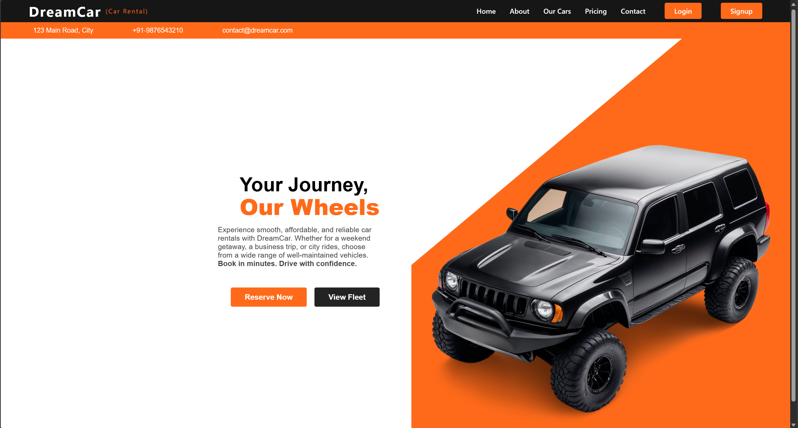
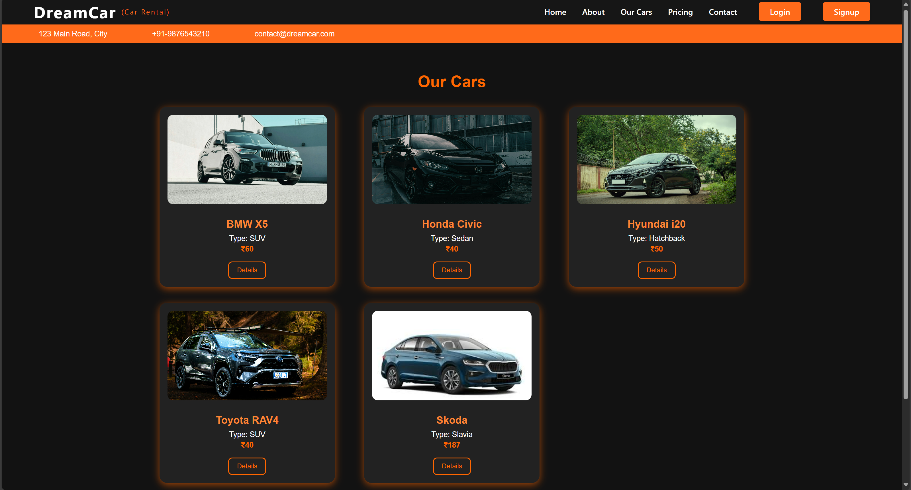

# 🚗 Car Rental Management System

A full-stack **Car Rental Web Application** built using **React (Vite)** for the frontend, **Spring Boot** for the backend, and **MySQL (Railway)** for data storage.  
Deployed seamlessly on **Vercel**, **Render**, and **Railway**.

---

## 🌐 Live Demo

- **Frontend:** [https://carrentalbyphanindra-tan.vercel.app](https://carrentalbyphanindra-tan.vercel.app)  
- **Backend API:** [https://carrental-project-8862.onrender.com](https://carrental-project-8862.onrender.com)

---

## 🧰 Tech Stack

| Layer | Technology |
|:------|:------------|
| **Frontend** | React (Vite), Axios, React Router, Toastify |
| **Backend** | Spring Boot (REST API) |
| **Database** | MySQL (Railway) |
| **Deployment** | Vercel → Frontend, Render → Backend, Railway → Database |
| **Cloud Storage** | Cloudinary (for image uploads) |

---

## ✨ Features

- 🚘 Browse and book cars in real-time  
- 🔑 Secure user authentication (login/register)  
- 🧾 Admin panel for managing users, cars, and bookings  
- ☁️ Cloudinary integration for car image uploads  
- 📱 Fully responsive UI across all devices  
- ⚙️ End-to-end deployment with CI/CD workflow  

---

## 🏗️ Deployment Details

| Service | Purpose | URL |
|:---------|:---------|:----|
| **Vercel** | Frontend Hosting | [Frontend Link](https://carrentalbyphanindra-tan.vercel.app) |
| **Render** | Backend API Hosting | [Backend Link](https://carrental-project-8862.onrender.com) |
| **Railway** | MySQL Database | Managed Cloud Database |

---

## 🖼️ Screenshots

### 🏠 Home Page


### 🚗 Our Cars Page


> *(Add more screenshots as needed inside `frontend/public/` folder)*

---

## ⚡ Quick Start (Local Setup)

Follow these steps to run the project locally 👇

### 1️⃣ Clone the Repository
```bash
git clone https://github.com/phanindrareddy2006/CarRental-Project.git
cd CarRental-Project
````

---

### 2️⃣ Backend Setup (Spring Boot)

```bash
cd car-rental-backend
# Open in Spring Tool Suite (STS) or any IDE
mvn spring-boot:run
```

* Configure your database connection in `application.properties`
* Make sure MySQL is running locally or connected via Railway

---

### 3️⃣ Frontend Setup (React + Vite)

```bash
cd ../frontend
npm install
npm run dev
```

* The app will start on [http://localhost:5173](http://localhost:5173)
* Update `.env` file with your backend API URL if needed

---

## 📂 Project Structure

```
CarRental-Project/
│
├── frontend/                # React (Vite) Frontend
│   ├── public/
│   ├── src/
│   ├── package.json
│   └── vite.config.js
│
├── car-rental-backend/      # Spring Boot Backend
│   ├── src/main/java/
│   ├── src/main/resources/
│   ├── pom.xml
│   └── target/
│
└── README.md
```

---

## 👨‍💻 Author

**Donthireddy Phanindra Reddy**
💼 B.Tech CSE, KL University
🌐 [GitHub @phanindrareddy2006](https://github.com/phanindrareddy2006)
✉️ [2300032080@kluniversity.in](mailto:2300032080@kluniversity.in)

---

⭐ **If you like this project, consider giving it a star!**

```

---

Would you like me to add **badges** (like “Made with React”, “Spring Boot”, “Deployed on Vercel”) at the top for a more **professional open-source look**?
```
