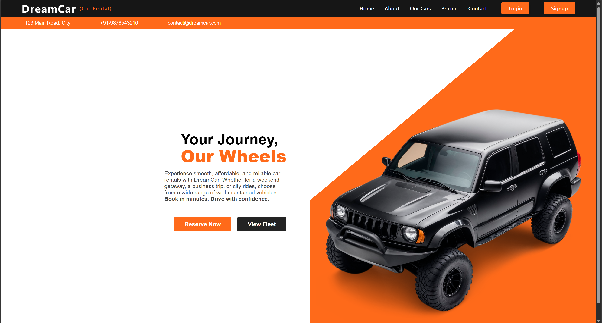
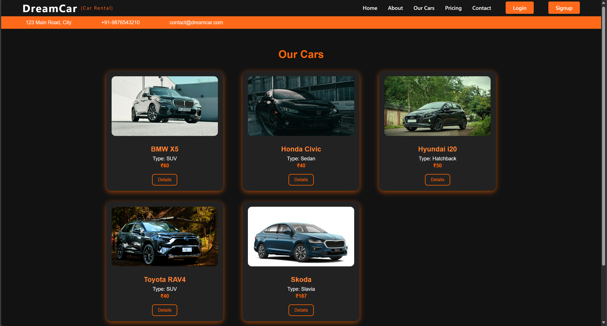

<p align="center">
  
</p>

<h1 align="center">🚗 Car Rental Management System</h1>
<p align="center">Built with passion by <b>Phanindra</b></p>

---

<p align="center">
  
  
  
  
  
</p>

---

A full-stack **Car Rental Web Application** built using **React (Vite)** for the frontend, **Spring Boot** for the backend, and **MySQL (Railway)** for data storage.  
Deployed seamlessly on **Vercel**, **Render**, and **Railway**.

---

## 🌐 Live Demo

- **Frontend:** [CarRental](https://carrental.tooncore.me/)  
- **Backend API:** [https://carrental-project-8862.onrender.com](https://carrental-project-8862.onrender.com)

---

## 🧰 Tech Stack

| Layer | Technology |
|:------|:------------|
| **Frontend** | React (Vite), Axios, React Router, Toastify |
| **Backend** | Spring Boot (REST API) |
| **Database** | MySQL (Railway) |
| **Deployment** | Vercel → Frontend, Render → Backend, Railway → Database |
| **Cloud Storage** | Cloudinary (for image uploads) |

---

## ✨ Features

- 🚘 Browse and book cars in real-time  
- 🔑 Secure user authentication (login/register)  
- 🧾 Admin panel for managing users, cars, and bookings  
- ☁️ Cloudinary integration for car image uploads  
- 📱 Fully responsive UI across all devices  
- ⚙️ End-to-end deployment with CI/CD workflow  

---

## 🏗️ Deployment Details

| Service | Purpose | URL |
|:---------|:---------|:----|
| **Vercel** | Frontend Hosting | [Frontend Link](https://carrental.tooncore.me/) |
| **Render** | Backend API Hosting | [Backend Link](https://carrental-project-8862.onrender.com) |
| **Railway** | MySQL Database | Managed Cloud Database |

---

## 🖼️ Screenshots

### 🏠 Home Page


### 🚗 Our Cars Page


> *(Add more screenshots as needed inside `frontend/public/` folder)*

---

## ⚡ Quick Start (Local Setup)

Follow these steps to run the project locally 👇

### 1️⃣ Clone the Repository
```bash
git clone https://github.com/phanindrareddy2006/CarRental-Project.git
cd CarRental-Project
2️⃣ Backend Setup (Spring Boot)
bash
Copy code
cd car-rental-backend
# Open in Spring Tool Suite (STS) or any IDE
mvn spring-boot:run
Configure your database connection in application.properties

Make sure MySQL is running locally or connected via Railway

3️⃣ Frontend Setup (React + Vite)
bash
Copy code
cd ../frontend
npm install
npm run dev
The app will start on http://localhost:5173

Update .env file with your backend API URL if needed

📂 Project Structure
css
Copy code
CarRental-Project/
│
├── frontend/                # React (Vite) Frontend
│   ├── public/
│   ├── src/
│   ├── package.json
│   └── vite.config.js
│
├── car-rental-backend/      # Spring Boot Backend
│   ├── src/main/java/
│   ├── src/main/resources/
│   ├── pom.xml
│   └── target/
│
└── README.md

```
## 👨‍💻 Author  
**Phanindra Reddy**  
💼 B.Tech CSE, KL University  
🌐 [GitHub @phanindrareddy2006](https://github.com/phanindrareddy2006)  
🔗 [LinkedIn @phanindrareddy](https://www.linkedin.com/in/phanindrareddy)  


<p align="center">⭐ If you like this project, consider giving it a star!</p> <p align="center">✨ Made with passion and creativity by <b>Phanindra</b> ✨</p>
